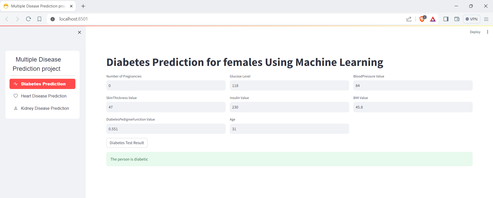
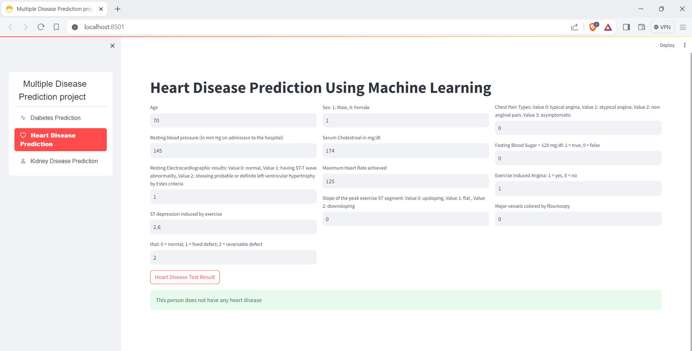
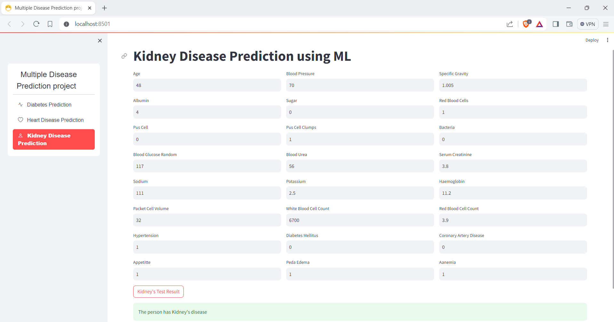

<h1>Disease Prediction Web Application</h1>

<h2>Overview</h2>
<!-- #overview -->

This project is a Streamlit web application designed to predict the likelihood of heart disease, kidney disease, and diabetes. The application leverages machine learning models to provide accurate predictions based on user input data. The project includes extensive exploratory data analysis (EDA) and the implementation of multiple machine learning models.

<!-- #project, #streamlit, #heartdisease, #kidneydisease, #diabetes, #machinelearning, #prediction, #eda -->
<h2>Table of Contents</h2>
<!-- #tableofcontents -->
<ul>
  <li><a href="#overview">Overview</a></li>
  <li><a href="#features">Features</a></li>
  <li><a href="#datasets">Datasets</a></li>
  <li><a href="#exploratory-data-analysis">Exploratory Data Analysis</a></li>
  <li><a href="#machine-learning-models">Machine Learning Models</a></li>
  <li><a href="#installation">Installation</a></li>
  <li><a href="#usage">Usage</a></li>
  <li><a href="#contributing">Contributing</a></li>
  <li><a href="#license">License</a></li>
  <li><a href="#contact">Contact</a></li>
</ul>
<!-- #tableofcontents -->
<h2>Features</h2>
<!-- #features -->
<ul>
  <li><strong>Prediction Models</strong>: Provides predictions for heart disease, kidney disease, and diabetes.</li>
  <li><strong>User-Friendly Interface</strong>: Interactive and easy-to-use interface built with Streamlit.</li>
  <li><strong>Visual Insights</strong>: Displays key patterns and trends from the datasets through visualizations.</li>
</ul>
<!-- #predictionmodels, #userinterface, #visualinsights -->
<h2>Datasets</h2>
<!-- #datasets -->

The application uses three distinct datasets:

<ol>
  <li><strong>Heart Disease Dataset</strong>: Contains various health metrics and target labels indicating the presence of heart disease.</li>
  <li><strong>Kidney Disease Dataset</strong>: Includes features related to kidney function and target labels for kidney disease.</li>
  <li><strong>Diabetes Dataset</strong>: Comprises health measurements and target labels for diabetes status.</li>
</ol>
<!-- #datasets, #heartdisease, #kidneydisease, #diabetes -->
<h2>Exploratory Data Analysis</h2>
<!-- #eda -->

Extensive EDA was performed on each dataset to:

<ul>
  <li>Understand the distribution and relationships of features.</li>
  <li>Identify missing values and outliers.</li>
  <li>Visualize key trends and correlations using plots and charts.</li>
</ul>
<!-- #eda, #datavisualization -->
<h2>Machine Learning Models</h2>
<!-- #machinelearning -->

Multiple machine learning models were implemented and evaluated to ensure accurate predictions:

<ul>
  <li><strong>Logistic Regression</strong></li>
  <li><strong>Support Vector Machines (SVM)</strong></li>
</ul>
<!-- #logisticregression, #decisiontrees, #randomforests, #svm, #gradientboosting -->
<h2>Contributing</h2>
<!-- #contributing -->

Contributions are welcome! If you would like to contribute to this project, please follow these steps:

<ol>
  <li>Fork the repository.</li>
  <li>Create a new branch (<code>git checkout -b feature-branch</code>).</li>
  <li>Commit your changes (<code>git commit -m 'Add some feature'</code>).</li>
  <li>Push to the branch (<code>git push origin feature-branch</code>).</li>
  <li>Open a pull request.</li>
</ol>
<!-- #contributions, #opensource -->
<h2>License</h2>
<!-- #license -->

This project is licensed under the MIT License. See the <a href="LICENSE">LICENSE</a> file for more details.

<!-- #mitlicense -->
<h2>Contact</h2>
<!-- #contact -->

For any questions or feedback, please contact me at <a href="mailto:your-email@example.com">your-email@example.com</a>.

<!-- #contactinfo -->
